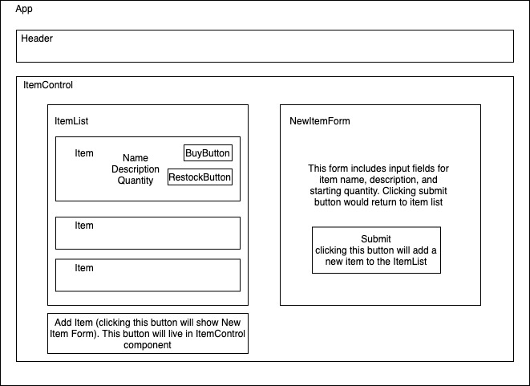

# Earth Day Merch

### A website for selling Earth Day merchandise. April 22-23, 2020
#### By: Benjamin Thom, Michelle Morin, Brandan Sayarath

## Description

_This application..._

## Component Tree

## Wireframe Design

## Specification User Stories
* A user should be able to create, read, update, and delete items in the store.
* A user should be able to buy an item in the store, which reduces item quantity by 1.
* A user should be able to restock an item, which increases item quantity by a fixed amount.
* When the quantity of an item is 0, the item should say "out of stock". A user should not be able to reduce the quantity of an item below 0.

## Setup/Installation Requirements

#### Node install

###### For macOS:
_If Homebrew is not installed on your computer already, then install Homebrew by entering the following two commands in Terminal:_
* $ /usr/bin/ruby -e "$(curl -fsSL https://raw.githubusercontent.com/Homebrew/install/master/install)"
* $ echo 'export PATH=/usr/local/bin:$PATH' >> ~/.bash_profile

_Install Git with the following command:_
* $ brew install git

_Next, install Node.js by entering the following command in Terminal:_
* $ brew install node

###### For Windows:
_Please visit the [Node.js website](https://nodejs.org/en/download/) for installation instructions._

#### Install this application

_Clone this repository via Terminal using the following commands:_
* _$ cd desktop_
* _$ git clone {url to this repository}_
* _$ cd merch-site_
_Then, confirm that you have navigated to the merch-site project directory by entering "pwd" in Terminal._

_Next, install npm at the project's root directory via the following commands:_
* _$ npm install_
* _$ npm run build_

_Open the contents of the directory in a text editor or IDE of your choice (e.g., to open the contents of the directory in Visual Studio Code on macOS, enter the command "code ." in Terminal)._

## Technologies Used

* Git
* JavaScript
* npm
* Webpack
* React

### License

[MIT](https://choosealicense.com/licenses/mit/)

Copyright (c) 2020 **_Michelle Morin, Benjamin Thom, Brandan Sayarath_** 